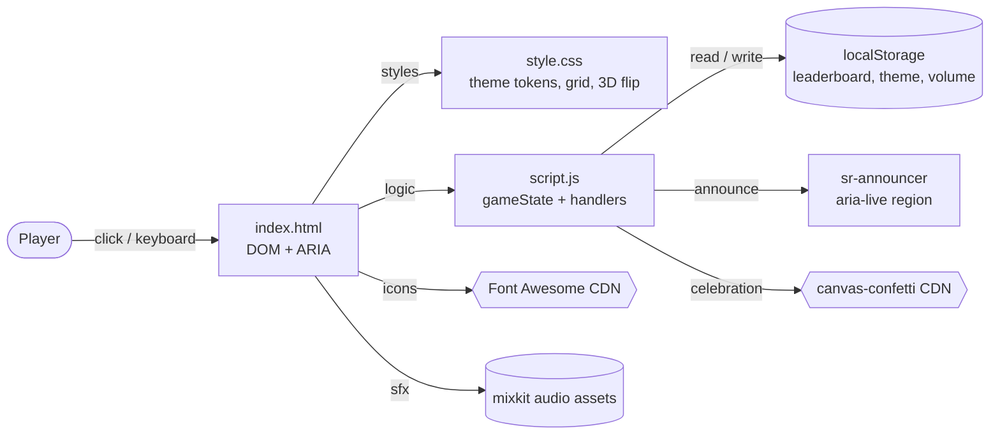

# Memory Game — Step-by-Step Build Guide

> **Archived: original build playbook.** This document is the original roadmap used to build the Memory Game project from scratch. The codebase may have evolved since this guide was written; for current setup, architecture, and deployment notes, see [../README.md](../README.md).

---

> **Project Summary:** Memory Game is an accessible, responsive card-matching game built with vanilla JavaScript. The player finds matching emoji pairs across four levels of increasing difficulty (from 12 to 24 cards); moves and time are tracked live, and results are stored in a `localStorage`-based leaderboard. Key features: 3D CSS card-flip animation, dark/light theme, sound effects with volume control, confetti celebration, full keyboard navigation, and screen reader support (ARIA + live region). Architecture layers: semantic HTML5 markup, theme management via CSS variables, performant event handling through event delegation, and persistent state via `localStorage`. The stack is fully client-side; there is no build tool or backend.

Each step below is a self-contained prompt. Execute them in order.

Stack: HTML5, CSS3 (Grid, Flexbox, 3D transforms, CSS Variables), Vanilla JavaScript (ES6+), Web Storage API (localStorage), Font Awesome 6 (CDN), canvas-confetti (CDN).

---

## Table of Contents

**PHASE 1 — Project Foundation & Markup**

- STEP 1 — Project Scaffolding & File Setup
- STEP 2 — Semantic HTML Structure & Accessibility Landmarks

**PHASE 2 — Styling & Theming**

- STEP 3 — CSS Variables, Theme Tokens & Base Layout
- STEP 4 — Responsive Game Board Grid & 3D Card Flip

**PHASE 3 — Core Game Logic**

- STEP 5 — Game State, Level Config & Deck Generation
- STEP 6 — Board Rendering, Flip & Match Detection

**PHASE 4 — Features & Polish**

- STEP 7 — Timer, Moves, Matched Deck & Win Flow
- STEP 8 — Sound, Confetti, Dark Mode & Volume
- STEP 9 — Leaderboard & localStorage Persistence

**PHASE 5 — Accessibility, Docs & Deploy**

- STEP 10 — Keyboard Navigation, ARIA & Reduced Motion
- STEP 11 — Documentation, Community Files & Deployment

**Appendices**

- Appendix A — Shared Constants
- Appendix B — Reusable Patterns
- Appendix C — Common Pitfalls
- Appendix D — Pre-Flight Checklist

---

## Global Build Rules (apply to EVERY step)

- **No git operations.** Version control is handled manually by the user. Do not run `git` commands, commit, or push unless the user explicitly asks.
- Do not install unapproved packages. The project relies on native web APIs and only two lightweight CDN dependencies (Font Awesome, canvas-confetti).
- Do not start long-running processes unless requested (opening the static file in a browser is enough to test the game).
- Treat every step as a self-contained task.
- Code must always be clean, readable, and use `camelCase` English naming.
- Use ES6+; follow the DRY principle and extract repeated logic into helper functions.
- Performance, security, and accessibility (a11y) are a priority in every step.

---

## Architecture at a Glance



Memory Game is a single-page, client-side application. `index.html` defines the structure and accessibility landmarks; `style.css` provides theming via CSS variables, grid layout, and the 3D animation; `script.js` runs all game logic around a `gameState` object. Persistent data (leaderboard, theme, volume) is kept in `localStorage`. Two CDN dependencies are used for icons and confetti, and external mixkit assets are used for sound.

---

# PHASE 1 — PROJECT FOUNDATION & MARKUP

---

## STEP 1 — Project Scaffolding & File Setup

**Goal:** Set up the minimal, build-tool-free static project skeleton.

**Files/folders to create:**

- `index.html` — application entry point
- `style.css` — all styles
- `script.js` — all game logic

**Implementation notes:**

- No build system, bundler, or `package.json`. Files can be opened directly in the browser.
- For live reload during development, use VS Code "Live Server", `python -m http.server`, or `npx serve`.
- Set UTF-8 encoding and `lang="en"`; UTF-8 is required for emoji content.

**Acceptance checklist:**

- [ ] All three files exist at the project root
- [ ] `index.html` opens in the browser without errors (even if empty)
- [ ] `style.css` and `script.js` are linked to the HTML

---

## STEP 2 — Semantic HTML Structure & Accessibility Landmarks

**Goal:** Build an accessible, semantic skeleton.

**Files to edit:** `index.html`

**Implementation notes:**

- In `<head>`, add `meta charset`, a responsive `viewport`, and a descriptive `meta description`.
- Add the Font Awesome and canvas-confetti CDN links with an `integrity` (SRI) hash and `crossorigin` (see Appendix C).
- Page skeleton:
  - A visually hidden `aria-live="polite"` `#sr-announcer` (screen reader announcements)
  - A `.skip-link` for keyboard users (jump to `#game-board`)
  - `header`: `h1` title, theme toggle button (sun/moon SVG), `stats-bar` (Level / Time / Moves)
  - `main#game-board` with `role="grid"` (cards are generated here)
  - `.controls`: Restart button + volume control (`input[type=range]`)
  - `#matched-container`: the stack of matched cards
  - `.leaderboard-section`: score list + clear scores button
  - `#modal` with `role="dialog" aria-modal="true"` (level completion)
  - Two `<audio>` elements for win and match sounds

**A11y expectations:**

- Descriptive `aria-label` on all interactive elements.
- Statistic values use `aria-live="polite"`, while the timer uses `aria-live="off"` to prevent spam.
- Decorative icons use `aria-hidden="true"`.

**Acceptance checklist:**

- [ ] Page landmarks (header/main/section) are sensible
- [ ] Skip link becomes visible when focused via Tab
- [ ] CDN scripts include SRI hashes

---

# PHASE 2 — STYLING & THEMING

---

## STEP 3 — CSS Variables, Theme Tokens & Base Layout

**Goal:** Set up theme tokens and the base layout.

**Files to edit:** `style.css`

**Implementation notes:**

- Define light theme color variables in `:root` (`--bg-color`, `--primary-color`, `--accent-color`, `--card-back-bg`, shadows, etc.).
- Override the same variables with dark theme values in a `body.dark-mode` selector. This way the theme switch happens via a single class (DRY).
- Global `box-sizing: border-box` reset, flex-centered layout on `body`, and a smooth theme transition via `transition`.
- Add the `.sr-only` visually-hidden utility class.

**Acceptance checklist:**

- [ ] Colors change when the `dark-mode` class is added
- [ ] Theme variables are managed from a single place

---

## STEP 4 — Responsive Game Board Grid & 3D Card Flip

**Goal:** Grid layout and a realistic 3D card-flip animation.

**Files to edit:** `style.css`

**Implementation notes:**

- Use CSS Grid for `.game-board` and read the column count from a variable:

```css
.game-board {
  display: grid;
  grid-gap: var(--gap-size);
  grid-template-columns: repeat(var(--cols, 4), 1fr);
  perspective: 1000px;
}
```

- The column count is set by JavaScript via `gameBoard.style.setProperty('--cols', config.cols)`. **Important:** do not write the column count directly as an inline `grid-template-columns` style; otherwise the mobile `@media` override will not work (see Appendix C).
- 3D card flip: `.card { transform-style: preserve-3d; transition: transform 0.6s ... }`, `.card.flipped { transform: rotateY(180deg); }`. Front/back faces use `backface-visibility: hidden`.
- Inside `@media (max-width: 600px)`, use `.game-board { grid-template-columns: repeat(4, 1fr); }` for a fixed 4 columns on mobile.

**Performance/a11y expectations:**

- Focus indicators (`:focus-visible`) must be clear.
- `prefers-reduced-motion` support will be added later in STEP 10.

**Acceptance checklist:**

- [ ] Column count per level is correct on desktop
- [ ] Grid drops to 4 columns on mobile (no inline style blocking it)
- [ ] Cards flip smoothly

---

# PHASE 3 — CORE GAME LOGIC

---

## STEP 5 — Game State, Level Config & Deck Generation

**Goal:** Central state, level configuration, and deck generation.

**Files to edit:** `script.js`

**Implementation notes:**

- Collect all DOM references at the top of the file.
- Keep a single `gameState` object (cards, flippedCards, matchedPairs, moves, time, timerInterval, level, isLocked, volume, isDarkMode).
- The `levels` configuration contains only `cols` and `pairs` (the unused `rows` field is not kept — see Appendix A).
- Select as many emojis as the pair count from the `emojis` array, creating two cards for each.
- Generate a unique id: use `crypto.randomUUID()`, with a fallback `createCardId()` helper for older browsers (do not use the deprecated `substr`).
- Shuffle the deck with Fisher-Yates (see Appendix B).

**Acceptance checklist:**

- [ ] The correct number of cards is generated for each level
- [ ] Card ids are unique
- [ ] The deck is ordered differently every game

---

## STEP 6 — Board Rendering, Flip & Match Detection

**Goal:** Render the cards and set up the flip and match logic.

**Files to edit:** `script.js`

**Implementation notes:**

- `renderBoard(cards)`: create a `div.card` for each card; add `dataset.id`, `dataset.value`, `tabindex="0"`, `role="button"`, `aria-label`, and `aria-pressed`. Front face shows the emoji, back face shows `?`.
- Use **event delegation** for event handling: a single listener on `gameBoard` (see Appendix B).
- `handleCardInteraction`: ignore locked, already-flipped, or matched cards.
- When two cards are flipped, call `incrementMoves()` and `checkForMatch()`.
- On a match call `disableCards` (mark matched after a short delay, remove from tab order); otherwise `unflipCards` (flip back after 1s). Use `isLocked = true` during the operation to prevent double clicks.

**Acceptance checklist:**

- [ ] Matched cards stay permanently revealed
- [ ] Mismatched cards flip back
- [ ] A third card cannot be opened during the animation

---

# PHASE 4 — FEATURES & POLISH

---

## STEP 7 — Timer, Moves, Matched Deck & Win Flow

**Goal:** Time/move tracking, the matched card stack, and the level completion flow.

**Files to edit:** `script.js`, `index.html`, `style.css`

**Implementation notes:**

- `startTimer`/`stopTimer`: count seconds with `setInterval`, display in `mm:ss` format. Always call `stopTimer` first on a new level/restart (prevent duplicate intervals).
- Move matched pairs to the bottom stack with `moveCardsToMatchedDeck`, leaving a placeholder (`card-placeholder`) in the grid.
- `checkWinCondition`: when `matchedPairs === config.pairs`, call `stopTimer`, `saveScore`, `handleLevelComplete`.
- `handleLevelComplete`: a "Play Again" modal if it is the last level, otherwise "Next Level". Move focus to the button when the modal opens.

**Acceptance checklist:**

- [ ] Time and moves increment correctly
- [ ] The modal appears when a level ends
- [ ] Restart resets the counters

---

## STEP 8 — Sound, Confetti, Dark Mode & Volume

**Goal:** Feedback effects and theme/sound preferences.

**Files to edit:** `script.js`

**Implementation notes:**

- Play the match and win sounds while `volume > 0`; wrap the `play()` promise with `catch` (autoplay blocking).
- On winning, trigger a 3-second celebration animation with `canvas-confetti`.
- `toggleDarkMode`: toggle the `body.dark-mode` class, write the preference to `localStorage`, update the theme icon, and announce to the screen reader.
- On the volume slider `input` event, update `gameState.volume` and save it to `localStorage`.

**Acceptance checklist:**

- [ ] The theme preference is preserved across page reloads
- [ ] The volume level is persistent
- [ ] Confetti and sound play on winning

---

## STEP 9 — Leaderboard & localStorage Persistence

**Goal:** Persistently store and display the best scores.

**Files to edit:** `script.js`

**Implementation notes:**

- Manage the keys from a single place with `STORAGE_KEYS` constants (see Appendix A).
- `saveScore`: add the new score, sort by level (desc) → moves (asc) → time (asc), and keep the top 10.
- `renderLeaderboard`: show an informative message if the list is empty, or a medal-iconed ranking if populated.
- `clearLeaderboard`: remove the key and re-render. Bind this function with `addEventListener` instead of an inline `onclick` (see Appendix C).

**Acceptance checklist:**

- [ ] Scores are sorted correctly and limited to the top 10
- [ ] Scores persist after a reload
- [ ] The clear button works

---

# PHASE 5 — ACCESSIBILITY, DOCS & DEPLOY

---

## STEP 10 — Keyboard Navigation, ARIA & Reduced Motion

**Goal:** Full keyboard support and accessibility improvements.

**Files to edit:** `script.js`, `style.css`

**Implementation notes:**

- Cards are navigable with Tab; flipped with `Enter`/`Space` (a `keydown` listener + `preventDefault`).
- Inside the modal, Tab keeps focus on the button; the `Escape` key triggers the primary button (the game advances) instead of closing the modal on an empty board.
- Write every state change to `#sr-announcer` via `announceToScreenReader`.
- Use `@media (prefers-reduced-motion: reduce)` to shorten animations; use `@media (prefers-contrast: high)` to strengthen focus/button borders.

**Acceptance checklist:**

- [ ] The game is fully playable with the keyboard
- [ ] The screen reader announces important events
- [ ] The reduced motion preference is respected

---

## STEP 11 — Documentation, Community Files & Deployment

**Goal:** Documentation, community health files, and deployment.

**Files to create/edit:** `README.md`, `.github/**`, `LICENSE`

**Implementation notes:**

- Write a comprehensive `README.md`: features, live demo, technologies, installation, usage, "How It Works", customization, and contributing sections.
- Keep community files under `.github/` (GitHub Community Standards detects these automatically):
  - `.github/CODE_OF_CONDUCT.md`
  - `.github/CONTRIBUTING.md`
  - `.github/SECURITY.md`
  - `.github/PULL_REQUEST_TEMPLATE.md`
  - `.github/ISSUE_TEMPLATE/bug_report.yml`, `feature_request.yml`, `config.yml`
- Fill the contact links in `config.yml` with the real repo URLs (`https://github.com/serkanbyx/memory-game/...`).
- Deployment: since it is a static site, it can be uploaded directly to Netlify, GitHub Pages, or Vercel; no build step is required.

**Acceptance checklist:**

- [ ] README follows the format rules and is up to date
- [ ] Community files are under `.github/`
- [ ] The live demo link works

---

# Appendix A — Shared Constants

```javascript
const levels = {
  1: { cols: 4, pairs: 6 },
  2: { cols: 4, pairs: 8 },
  3: { cols: 5, pairs: 10 },
  4: { cols: 6, pairs: 12 },
};

const emojis = [
  '🐶', '🐱', '🐭', '🐹', '🐰', '🦊', '🐻', '🐼',
  '🐨', '🐯', '🦁', '🐮', '🐸', '🐙', '🐵', '🦄',
  '🐞', '🦋', '🐠', '🦖',
];

const STORAGE_KEYS = {
  LEADERBOARD: 'memoryGame_leaderboard',
  THEME: 'memoryGame_theme',
  VOLUME: 'memoryGame_volume',
};
```

`levels` contains only `cols` and `pairs`; `rows` is not kept because it is used nowhere.

---

# Appendix B — Reusable Patterns

**Fisher-Yates Shuffle** — unbiased shuffling:

```javascript
function shuffleArray(array) {
  for (let i = array.length - 1; i > 0; i--) {
    const j = Math.floor(Math.random() * (i + 1));
    [array[i], array[j]] = [array[j], array[i]];
  }
  return array;
}
```

**Event Delegation** — a single listener instead of one per card (performance + dynamic elements):

```javascript
gameBoard.addEventListener('click', (e) => {
  const card = e.target.closest('.card');
  if (card) handleCardInteraction(card);
});
```

**Unique ID Helper** — modern API + fallback:

```javascript
function createCardId() {
  if (window.crypto?.randomUUID) {
    return window.crypto.randomUUID();
  }
  return `card-${Date.now()}-${Math.floor(Math.random() * 1e9)}`;
}
```

---

# Appendix C — Common Pitfalls

- **Inline style breaks the mobile grid:** If you write the column count inline via `gameBoard.style.gridTemplateColumns`, the `grid-template-columns` rule inside `@media` cannot override it without `!important`. Instead, set a `--cols` CSS variable and use `repeat(var(--cols, 4), 1fr)` in CSS.
- **Deprecated `String.substr`:** Do not use `substr` for id generation; prefer `crypto.randomUUID()` or `slice`.
- **Inline `onclick`:** Use `addEventListener` instead of `onclick="..."` in HTML (CSP compliance and consistency).
- **Missing SRI on CDN:** Add an `integrity` (sha384) hash and `crossorigin="anonymous"` to all external scripts. For canvas-confetti, compute the hash from the file's raw bytes.
- **Duplicate timer interval:** Always call `stopTimer()` before starting a new level/restart.
- **Autoplay sound error:** `audio.play()` returns a promise; wrap it with `.catch()`.
- **Modal Escape edge case:** When a level is complete, `Escape` should not close the modal on an empty board; it should trigger the primary button and advance the game.

---

# Appendix D — Pre-Flight Checklist

- [ ] All four levels work with the correct grid and pair count
- [ ] The grid drops to 4 columns on mobile
- [ ] Match/mismatch logic and locking are correct
- [ ] Time, moves, and leaderboard are persistent and consistent
- [ ] Theme and sound preferences are preserved in `localStorage`
- [ ] The game is fully playable with the keyboard; ARIA announcements work
- [ ] `prefers-reduced-motion` and `prefers-contrast` are supported
- [ ] CDN scripts include SRI hashes
- [ ] Community files are under `.github/` and URLs are correct
- [ ] README is up to date and the live demo link works
